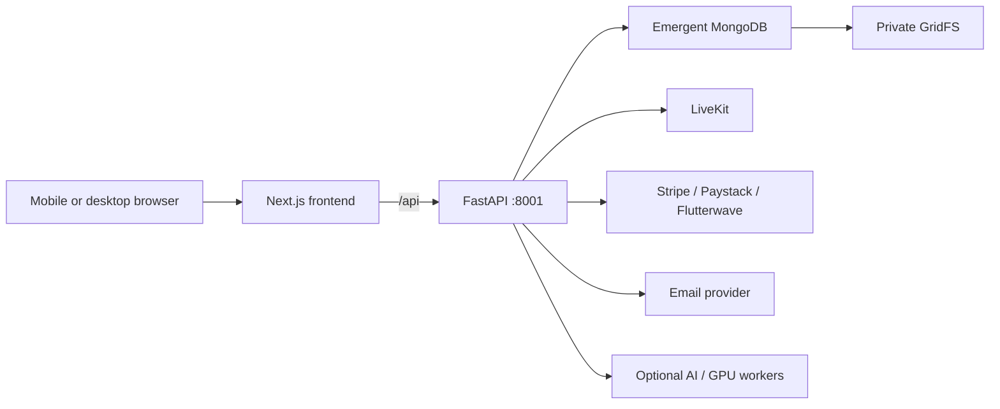

# Architecture

MongoDB is authoritative for users, sessions, plans, subscriptions, payments,
credit ledgers, rooms, participants, face profiles, consent, moderation,
notifications, provider settings and audit logs.

Provider credentials are AES-256-GCM encrypted with a deployment master key.
Browser processing remains modular and can use MediaPipe/WebGL locally or a
future cloud GPU adapter.
