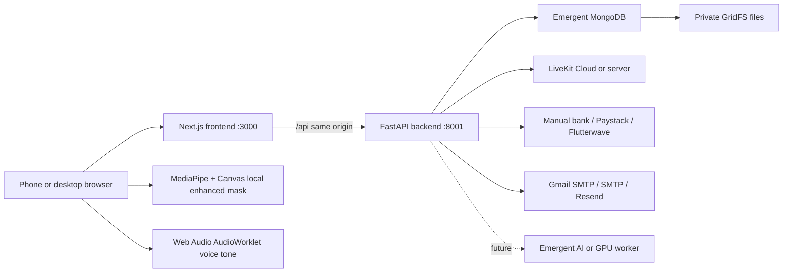

# Architecture

MongoDB stores users, sessions, plans, subscriptions, wallets, ledger entries,
payments, rooms, participants, face metadata, consent, moderation, provider
settings and audit logs. GridFS stores private face images and receipts.

Provider secrets are encrypted with AES-256-GCM. Environment variables are
fallback values; an encrypted admin value overrides the matching fallback.

The storage and AI boundaries are adapter-ready. External R2/S3 and cloud
face inference are configuration contracts only; the active launch adapters
are GridFS, local face masking and browser voice-tone processing. Both
processed media tracks replace the original LiveKit publication and restore
the original track if publication fails.
