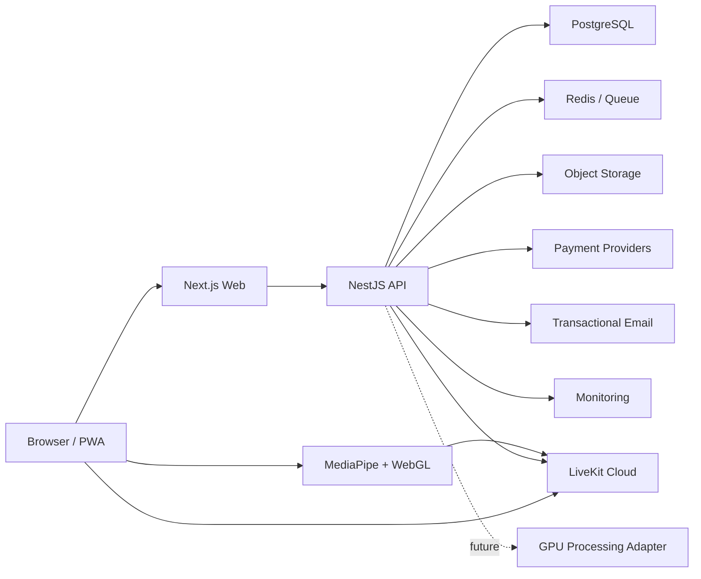

# TrueFace Calls Production SaaS Design

**Status:** Approved by the product owner through delegated decision authority on June 11, 2026.

## 1. Product Boundary

TrueFace Calls is a consent-first browser video calling SaaS. It combines ordinary secure LiveKit calls with optional, visibly disclosed face replacement using a face image the user owns or is authorized to use.

The launch foundation must provide real authentication, persistent data, billing ledgers, room authorization, uploads, moderation, provider configuration, and a browser media pipeline. Capabilities that require commercial credentials remain disabled with an explicit setup state; they must never pretend to succeed.

The product must not:

- Market itself as an impersonation, evasion, or deception tool.
- Hide synthetic-face use from other participants.
- publish the raw camera track while AI mode is active.
- permit a face profile without all required consent attestations.
- support cloning a real person's voice without documented authorization.

## 2. Delivery Approach

### Selected approach: provider-agnostic modular monolith

Use one TypeScript monorepo with independently deployable web and API applications:

- `apps/web`: Next.js App Router for marketing, user application, and admin dashboard.
- `apps/api`: NestJS REST/WebSocket API.
- `packages/database`: Prisma schema and migrations for PostgreSQL.
- `packages/contracts`: Zod schemas, DTOs, permissions, events, and shared constants.
- `packages/media-engine`: browser face tracking and processed-track publication.
- `packages/providers`: payment, storage, email, LiveKit, Redis, and future GPU adapters.
- `packages/ui`: shared accessible interface components and design tokens.

This gives a single importable repository for Emergent while preserving deployable boundaries. A microservice split is deferred until usage data justifies it.

### Alternatives considered

1. **Single Next.js application with route handlers:** fastest initial setup, but weak ownership boundaries for media authorization, webhooks, queues, and admin audit work.
2. **Microservices from day one:** maximal isolation, but too much operational cost before product-market fit.
3. **Selected modular monolith:** production boundaries without premature distributed-system overhead.

## 3. Runtime Architecture



### Trust boundaries

- Browser requests short-lived LiveKit access tokens from the API.
- API is the source of truth for rooms, permissions, consent, plans, credits, and moderation.
- LiveKit transports media and data but does not decide product entitlement.
- Storage objects are private. Browser access uses short-lived signed upload/download URLs.
- Provider credentials are encrypted at rest and are decrypted only inside the API process.
- Webhooks are signature-verified and idempotent before changing billing state.

## 4. Repository Structure

```text
trueface-calls/
  apps/
    web/
      app/
        (marketing)/
        (auth)/
        (app)/
        admin/
        call/[slug]/
      components/
      features/
      lib/
      public/
      tests/
    api/
      src/
        auth/
        users/
        faces/
        rooms/
        calls/
        billing/
        credits/
        providers/
        moderation/
        admin/
        notifications/
        health/
        common/
      test/
  packages/
    contracts/
    database/
    media-engine/
    providers/
    ui/
    config/
  docs/
    architecture/
    deployment/
    operations/
    security/
    superpowers/
  infra/
    docker/
    emergent/
  .github/workflows/
```

## 5. Data Model

All primary keys are UUIDs. Timestamps use UTC. Money uses integer minor units. Credits use integer milli-credits so fractional per-minute rates remain exact.

### Identity and access

- `users`: email, password hash, display name, avatar, status, email verification, locale, timezone, last login, deletion schedule.
- `sessions`: hashed refresh token, user, expiry, revocation, IP hash, user agent.
- `devices`: user, device fingerprint hash, capabilities, last seen, trust/revocation state.
- `admin_users`: user, role, permissions, MFA requirement, active state.

### Face safety

- `face_profiles`: user, name, private object key, thumbnail key, quality score, moderation state, retention state, encrypted metadata, deletion timestamp.
- `consent_logs`: user, face profile, attestation versions, IP hash, user agent, accepted timestamp, revoked timestamp.
- `face_moderation_events`: profile, decision, reason codes, moderator, model signals, timestamps.

### Calls

- `call_rooms`: host, slug, signed invite version, password hash, waiting-room state, guest policy, max participants, group entitlement, expiry, lifecycle state.
- `call_participants`: room, user or guest identity, role, join state, approval state, LiveKit identity, joined/left timestamps, blocked state.
- `call_history`: room, started/ended timestamps, participant count, quality summary, termination reason.
- `call_events`: room, actor, event type, structured payload, timestamp.
- `blocked_users`: blocker, blocked user, reason, timestamp.

### Billing

- `plans`: provider-agnostic plan key, limits, included credits, price metadata, enabled state.
- `subscriptions`: user/team, plan, provider, external references, status, period, cancellation and retry fields.
- `payments`: user, provider, type, amount/currency, status, external reference, idempotency key.
- `refunds`: payment, amount, reason, provider reference, status.
- `credit_wallets`: owner, available, reserved, lifetime purchased/consumed, optimistic version.
- `credit_transactions`: wallet, immutable type, amount, balance after, source, room/payment references, idempotency key.
- `usage_minutes`: room/participant, mode, quality, billable milliseconds, applied rate, credits charged, metering window.

### Operations

- `abuse_reports`: reporter, room, reported user/face profile, category, evidence object key, status, assignment, resolution.
- `audit_logs`: actor, action, target, before/after redacted JSON, request ID, IP hash, timestamp.
- `notifications`: audience, channel, title/body, delivery state.
- `app_settings`: namespace/key, encrypted value or public JSON value, version, updated by.
- `provider_health`: provider, status, latency, last check, redacted error.
- `teams` and `team_members`: business-plan ownership and roles.

## 6. API Route List

All API routes are versioned under `/v1`. Mutations require CSRF protection for cookie-authenticated browser requests. Admin routes require RBAC and MFA-ready session claims.

### Authentication

- `POST /auth/signup`
- `POST /auth/login`
- `POST /auth/refresh`
- `POST /auth/logout`
- `POST /auth/verify-email`
- `POST /auth/resend-verification`
- `POST /auth/forgot-password`
- `POST /auth/reset-password`
- `GET /auth/session`

### Users and privacy

- `GET /me`
- `PATCH /me`
- `GET /me/devices`
- `DELETE /me/devices/:id`
- `GET /me/privacy-export`
- `POST /me/delete-account`
- `GET /me/blocked-users`
- `POST /me/blocked-users/:userId`
- `DELETE /me/blocked-users/:userId`

### Faces and consent

- `POST /faces/upload-url`
- `POST /faces/quality-check`
- `POST /faces`
- `GET /faces`
- `GET /faces/:id`
- `PATCH /faces/:id`
- `DELETE /faces/:id`
- `POST /faces/:id/consent`
- `POST /faces/:id/revoke`

### Rooms and calls

- `POST /rooms`
- `GET /rooms/:slug`
- `PATCH /rooms/:id`
- `POST /rooms/:id/invites`
- `POST /rooms/:id/join-request`
- `POST /rooms/:id/approve/:participantId`
- `POST /rooms/:id/reject/:participantId`
- `POST /rooms/:id/token`
- `POST /rooms/:id/end`
- `POST /rooms/:id/meter/start`
- `POST /rooms/:id/meter/heartbeat`
- `POST /rooms/:id/meter/stop`
- `GET /calls/history`
- `GET /calls/:id`

### Billing and credits

- `GET /plans`
- `GET /billing/subscription`
- `POST /billing/checkout/subscription`
- `POST /billing/checkout/credits`
- `POST /billing/portal`
- `GET /billing/payments`
- `GET /billing/refunds`
- `GET /credits/wallet`
- `GET /credits/transactions`
- `POST /webhooks/stripe`
- `POST /webhooks/paystack`
- `POST /webhooks/flutterwave`

### Safety and support

- `POST /abuse-reports`
- `GET /support/articles`
- `POST /support/tickets`
- `GET /notifications`
- `POST /notifications/:id/read`

### Admin

- `GET /admin/overview`
- `GET /admin/users`
- `PATCH /admin/users/:id/status`
- `GET /admin/subscriptions`
- `GET /admin/payments`
- `POST /admin/credits/adjust`
- `GET /admin/calls`
- `GET /admin/usage`
- `GET /admin/faces/moderation`
- `POST /admin/faces/:id/decision`
- `GET /admin/abuse-reports`
- `PATCH /admin/abuse-reports/:id`
- `GET /admin/providers`
- `PUT /admin/providers/:provider`
- `POST /admin/providers/:provider/test`
- `GET /admin/plans`
- `PUT /admin/plans/:id`
- `GET /admin/settings`
- `PUT /admin/settings/:namespace/:key`
- `POST /admin/notifications/broadcast`
- `GET /admin/audit-logs`

## 7. User Flow

1. User signs up, verifies email, and receives a trial wallet grant.
2. Dashboard shows actual wallet balance, plan limits, and provider setup state.
3. Creating a room checks account status, plan limits, and credit minimum.
4. Host receives an expiring signed link and may add a password and waiting room.
5. Participant opens the link, runs device preflight, and joins as guest or user.
6. Host approves waiting users when enabled.
7. Normal mode publishes the camera track directly.
8. AI mode can only start after selecting an approved face profile with valid consent.
9. The browser starts a billing reservation, creates a processed track, unpublishes the raw camera track, and publishes only the processed track.
10. A persistent participant-visible disclosure is sent through track metadata and LiveKit data messages.
11. Meter heartbeats settle immutable usage windows. Insufficient credit stops AI processing before disconnecting the base call.
12. Call completion writes history and releases unused reserved credits.

## 8. Subscription and Credit Flow

### Subscription state

`trialing -> active -> past_due -> suspended -> canceled`

Provider webhooks are authoritative. Checkout redirects never directly activate a subscription.

### Credit wallet rules

- Trial grant is an immutable `TRIAL_GRANT` transaction with an expiry policy.
- Checkout creates a pending payment; verified webhook creates `PURCHASE`.
- Starting AI mode creates a bounded `RESERVATION`.
- Meter windows settle `USAGE` transactions and reduce the reservation.
- Stopping releases remaining reservation using `RESERVATION_RELEASE`.
- Admin changes require a reason and create `ADMIN_ADJUSTMENT`.
- Refunds create `REFUND_DEBIT` only after provider confirmation.
- Every operation is idempotent and uses a database transaction with wallet version checks.

### Rate formula

```text
credits_per_minute =
  base_call_rate
  + ai_face_rate
  + voice_effect_rate
  + quality_surcharge
  + cloud_gpu_surcharge
```

The API returns an estimate before activation. The server-calculated usage ledger is authoritative.

## 9. LiveKit Integration Plan

- API creates short-lived access tokens using provider credentials stored in encrypted settings.
- Token grants are scoped to one room and identity.
- Room metadata stores product room ID and policy version, never secrets.
- Participant metadata includes role, AI disclosure state, and account/guest type.
- LiveKit webhooks update participant/call lifecycle records.
- Chat and lightweight moderation events use reliable LiveKit data packets.
- Screen share is a separate source track.
- Host controls map to API-authorized mute/remove/end operations.
- Reconnect relies on LiveKit SDK recovery, with API-side meter grace windows.
- A local adapter provides deterministic tests and setup-state UX without simulating successful external calls.

## 10. Browser AI Video Pipeline

```text
Camera MediaStream
  -> capability probe
  -> frame scheduler
  -> MediaPipe Face Landmarker worker
  -> tracking confidence gate
  -> landmark/expression/pose smoothing
  -> face asset mesh/warp adapter
  -> lighting/color adaptation
  -> WebGL compositor
  -> OffscreenCanvas / Canvas captureStream
  -> processed MediaStreamTrack
  -> LiveKit LocalVideoTrack
```

### Safety behavior

- AI starts only after a consent token is issued for the selected profile.
- Raw camera publication is removed before processed publication is announced active.
- If processed publication fails, the app turns AI off and asks before restoring the raw camera.
- Tracking loss freezes for a short grace period, then replaces output with a neutral paused frame and visible status.
- AI disclosure cannot be hidden by the local user.
- Face profiles are never sent to peers.

### Engine interfaces

- `FaceTracker`
- `FaceAssetLoader`
- `FaceRenderer`
- `ProcessedTrackPublisher`
- `CapabilityEvaluator`
- `UsageMeterClient`
- `CloudProcessingAdapter`

The initial renderer is a privacy-preserving, browser-local mesh/texture compositor. Photorealistic neural replacement is a later GPU adapter and must pass separate safety review.

## 11. Mobile Performance Strategy

### Profiles

| Mode     | Target | FPS   | Tracking                            | Billing multiplier |
| -------- | ------ | ----- | ----------------------------------- | ------------------ |
| Low      | 360p   | 12-15 | reduced landmarks, basic smoothing  | 1.0x               |
| Standard | 480p   | 20-24 | full landmarks, adaptive smoothing  | 1.5x               |
| HD       | 720p   | 24-30 | full landmarks, enhanced compositor | 2.5x               |

### Automatic degradation

- Inspect CPU cores, device memory when exposed, WebGL limits, camera capability, thermal symptoms inferred from frame time, and network quality.
- Run a three-second preflight benchmark without uploading frames.
- Reduce render resolution before capture resolution.
- Drop compositor FPS before LiveKit publisher FPS.
- Disable expensive lighting adaptation before disabling AI.
- Pause AI after sustained tracking or frame-budget failure.
- Persist only a coarse capability class, not a fingerprint.
- iPhone Safari uses Canvas/WebGL fallbacks when WebCodecs or OffscreenCanvas support is incomplete.

## 12. Admin Dashboard Plan

Navigation:

- Overview
- Users
- Calls
- AI usage
- Subscriptions
- Payments and refunds
- Credits
- Face moderation
- Abuse reports
- Blocked users
- Provider health
- LiveKit rooms
- GPU/server usage
- Notifications
- Plans and limits
- Branding
- Security
- Audit logs

Provider settings use typed forms. Secret fields are write-only after save and display only a fingerprint such as `...A91C`. Test actions return redacted status. Changes require admin re-authentication and create audit events.

## 13. Deployment Plan

### Emergent handles

- Repository import/pull through GitHub integration.
- Development workspace and preview.
- Application/container build.
- Production app hosting and permanent URL.
- SSL for the Emergent URL and custom-domain path.
- Production secret entry.
- Redeployment and preview-to-production workflow.
- Basic application availability surface.

### External managed services

- PostgreSQL: Neon, Supabase, Railway, or another standard PostgreSQL provider.
- Redis: Upstash or Redis Cloud.
- Object storage: Cloudflare R2, AWS S3, Supabase Storage, or Emergent-compatible S3 endpoint.
- LiveKit: LiveKit Cloud initially.
- Email: Resend or Postmark.
- Payments: Stripe, Paystack, and Flutterwave accounts.
- Monitoring: Sentry and optional OpenTelemetry backend.
- Future GPU: RunPod, Modal, AWS, Replicate, or custom worker.

Emergent's documented native production database is MongoDB, so it is not used as the application database for this PostgreSQL/Prisma build.

### Build contract

```bash
npm ci
npm run db:generate
npm run build
```

### Start contract

```bash
npm run start
```

The API runs database migrations during an explicit release command, not implicitly on every web process boot.

## 14. Security Checklist

- Argon2id password hashing.
- Short-lived access session plus rotating hashed refresh tokens.
- Email verification and password reset tokens stored as hashes.
- Secure, HttpOnly, SameSite cookies.
- CSRF protection for cookie mutations.
- Strict CORS allowlist.
- Helmet/CSP with LiveKit, storage, and payment origins explicitly configured.
- Per-IP and per-account rate limiting.
- Signed, expiring, versioned call invites.
- Optional Argon2-hashed room password.
- Waiting-room authorization on the API.
- Private encrypted object storage and signed URLs.
- Envelope encryption for provider credentials using `SETTINGS_MASTER_KEY`.
- Consent records with immutable terms versions.
- Participant-visible AI disclosure.
- Immutable credit ledger and idempotent webhooks.
- Webhook signature verification and replay protection.
- Admin RBAC, re-authentication for secrets/credits, MFA-ready claims.
- Structured redaction in logs and audit history.
- Face deletion job removes originals, derivatives, cached artifacts, and metadata.
- Account data export and deletion workflow.
- Abuse reporting, user blocking, moderation queues, and retention rules.
- No raw camera upload by the browser-local engine.
- Dependency, secret, and container scans in CI.
- Database backups and restore drills at the managed provider.

## 15. Testing and Release Gates

- Unit tests for rate calculation, entitlements, invite signing, encryption, webhook idempotency, and consent policy.
- API integration tests for auth, room authorization, wallet settlement, admin RBAC, and face lifecycle.
- Component tests for forms, disabled setup states, and responsive controls.
- Browser tests for signup, login, dashboard, room creation, guest preflight, face consent, AI toggle, and admin settings.
- Media tests use generated frames and a fake LiveKit adapter; real camera/LiveKit tests run only when credentials are present.
- Build must pass for all workspaces.
- Prisma migration must validate against PostgreSQL.
- No route may present a success state when its required provider is unconfigured.

## 16. Launch Definition

The repository is a production-ready foundation when:

- Core local flows persist to PostgreSQL and pass automated tests.
- Provider-backed flows are functional with credentials and clearly unavailable without them.
- Browser media pipeline publishes a processed canvas track in AI mode and does not publish the raw camera track concurrently.
- The admin can configure providers, plans, credits, limits, branding, and abuse policies.
- Builds, migrations, and startup commands are documented and verified.
- Mobile layouts pass iPhone and Android viewport audits.
- GitHub and Emergent import instructions are complete.
